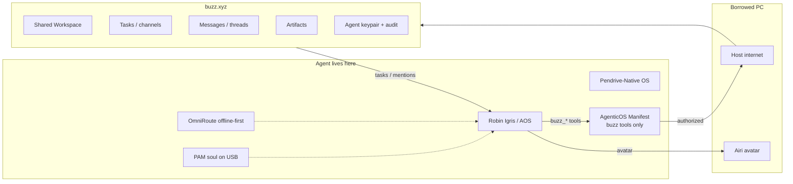

# Buzz.xyz — shared human + agent workspace

[Buzz](https://buzz.xyz) ([Block / open source](https://github.com/block/buzz)) is a
native workspace for **human + agent teams**. Robin Igris treats it as the agent’s
**shared coordination layer**; the pendrive keeps private identity and soul.



## Split of concerns

| What | Where | Why |
|------|-------|-----|
| Identity (`SOUL.md`) | Pendrive | Physical ownership |
| Private memories | Pendrive (PAM) | Encrypted / sealed tip |
| **Shared tasks & projects** | **buzz.xyz** | Collaborate with you |
| **Messages & threads** | **buzz.xyz** | Human–agent chat |
| **Artifacts** | **buzz.xyz** | Shared outputs |
| Local LLM | Borrowed GPU via OmniRoute | Offline-first |
| Cloud spillover | Host internet | Stronger reasoning |

## Install buzz-cli

```bash
# From Block's repo
git clone https://github.com/block/buzz.git
cd buzz && cargo install --path crates/buzz-cli

# Auth — agent gets its own keypair (NIP-98)
export BUZZ_PRIVATE_KEY="nsec1..."          # agent key
export BUZZ_RELAY_URL="https://YOUR.communities.buzz.xyz"  # from buzz.xyz signup
export BUZZ_CHANNEL_ID="<home-channel-uuid>"
```

Sign up / create a community at https://buzz.xyz — the app shows your relay URL.

## Robin env

```env
BUZZ_PRIVATE_KEY=nsec1...
BUZZ_RELAY_URL=https://onboarding.communities.buzz.xyz
BUZZ_CHANNEL_ID=
BUZZ_CLI=buzz
```

Manifest (`data/aos/manifest.json`) enables capability `buzz` and lists allowed tools
under `tools` — the **Logic Shutter**. Undeclared tools have no stubs.

## Tools (Manifest-scoped)

| Tool | Buzz CLI |
|------|----------|
| `buzz_status` | config check |
| `buzz_list_channels` | `buzz channels list` |
| `buzz_list_tasks` | `buzz messages get` |
| `buzz_read_thread` | `buzz messages thread` |
| `buzz_send_message` | `buzz messages send` |
| `buzz_complete_task` | send completion post |
| `buzz_upload_artifact` | `buzz upload file` |
| `buzz_request_human_input` | send 🙋 question |
| `buzz_search` | `buzz messages search` |
| `buzz_feed` | `buzz feed get` |

AOS shell: `:buzz` prints workspace status.

## End-to-end stack

```
Kernel        → Live USB / userspace AOS session
Identity      → SOUL + PAM on USB
Capabilities  → AgenticOS Manifest (buzz tools + voice + avatar)
Runtime       → AOS + OmniRoute (+ optional Hermes)
Routing       → OmniRoute (local ↔ cloud)
Interface     → AIRI avatar
Workspace     → buzz.xyz
Persistence   → PAM on stick
Shutdown      → Unplug → seal soul → replug → resume
```

The pendrive is the agent’s body. The borrowed PC is temporary senses. **buzz.xyz is the shared workspace with you.**
