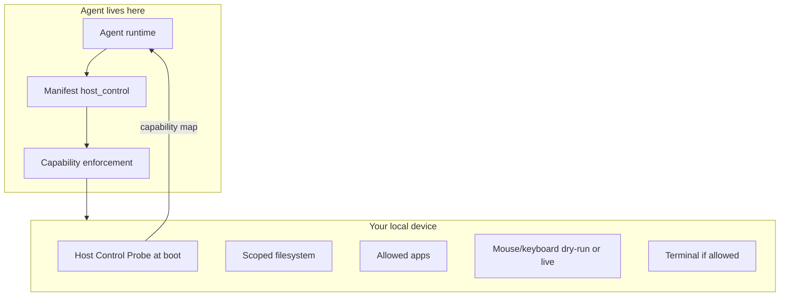

# Carry Host Bridge — Manifest-scoped control of your local device

**Carry** is the product name for the pendrive-native Agent OS (PNAOS).
The **Host Bridge** lets the agent act on the borrowed PC — filesystem, apps,
computer-use, terminal — only within the Manifest contract.

> Display + audio are always the avatar surface. Everything else is opt-in.



## Enable

In `data/aos/manifest.json`:

```json
{
  "capabilities": { "host_control": true, "filesystem_host": true },
  "host_control": {
    "enabled": true,
    "filesystem": {
      "paths": [
        { "path": "~/Documents/projects/", "access": ["read", "write", "create"] },
        { "path": "~/Desktop/", "access": ["read", "write", "create"] }
      ],
      "rules": {
        "max_file_size_mb": 50,
        "require_approval_for": ["delete", "overwrite"]
      }
    },
    "applications": {
      "allowed": ["code", "browser", "terminal"],
      "actions": ["launch", "quit", "send_keystrokes"]
    },
    "computer_use": { "screenshot": true, "live": false },
    "terminal": { "allowed": false }
  }
}
```

Approvals: set `ROBIN_HOST_APPROVE=1`, or create `data/aos/approvals/<token>.approved`.  
Live input/commands: `ROBIN_HOST_LIVE=1` (default is dry-run).

## Tools

| Tool | Role |
|------|------|
| `host_status` | Contract + probe summary |
| `host_list_dir` / `host_read_file` / `host_write_file` / `host_delete_file` | Scoped FS |
| `host_launch_app` | Allowed apps only |
| `host_computer_use` | Mouse/keyboard/clipboard (dry-run unless live) |
| `host_run_command` | Terminal if Manifest allows; **sudo denied** |

AOS shell: `:host`

## Trust model

You trust both pendrive and host. The agent mediates. Undeclared actions never
reach the host — the Logic Shutter has no stub for them.
