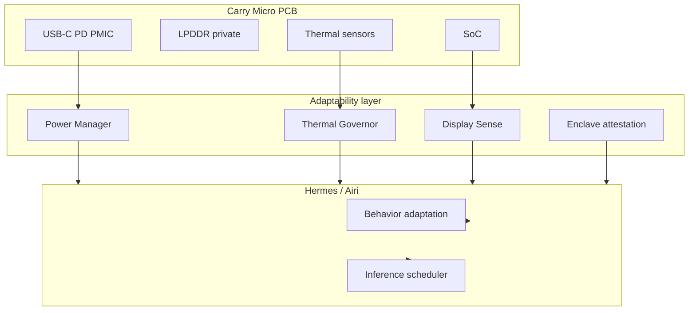

# Carry Micro Hardware — native RAM + adaptability

**Carry** is not only software on borrowed RAM. The north-star form factor is a
pendrive-sized PCB with **its own LPDDR**, SoC, storage, and (optional) secure
enclave — a body the agent cannot be cloned out of by copying files.

This repo ships the **adaptability contract** now (`aos/adaptability.py`) so the
agent already behaves as if that hardware exists. Real silicon is a later BOM.

## Physical layout (target)

```
~60 × 25 × 10 mm

USB-C (power + data + DP Alt Mode)
  ├── SoC (RK3588S / JH7110 / …) — CPU + GPU + NPU
  ├── LPDDR4x 4–8 GB — private native RAM
  ├── eMMC 64–128 GB + microSD
  ├── WiFi 6 + BT (optional module)
  └── Status OLED / LED (expression without a host screen)
```

Prototype BOM ~$80–120 · volume ~$35–50 · retail target ~$60–80.

## Adaptability matrix

### Display

| Path | When |
|------|------|
| `dp_alt` | USB-C DP Alt Mode — Airi renders directly |
| `usb_gadget` | No DP Alt — virtual display / USB net stream |
| `wifi_ui` | USB-A / no video — web UI or Buzz |
| `headless` | Server / silent — SSH / Buzz only |

### Power

| Source | Profile | Budget |
|--------|---------|--------|
| USB 2.0 | `powersave` | ~2.5 W |
| USB 3.0 | `standard` | ~4.5 W |
| USB-C PD | `turbo` | up to policy max |
| Host on battery | demote turbo → standard; quieter voice |

### Thermal

Metal shell as heatsink. Kernel reads on-die temp; throttle at Manifest
`thermal.throttle_c` (default 80°C). Modes: `silent` · `balanced` · `performance`.
Interactive voice beats bulk inference; idle batches memory/skill work.

### Host awareness

Respect host battery, Manifest WiFi, locked screen politeness. The Host Control
Probe still maps apps/paths; adaptability maps *how hard* to run.

### Enclave (philosophical leap)

On real PCB: identity keys born in secure world; casing-open tamper wipes them.
The agent **dies** with the board — eMMC clone is not the agent.
Userspace stub: `CARRY_ENCLAVE=1` / `CARRY_TAMPER=1`.

## Manifest

```json
{
  "adaptability": {
    "board": "carry-micro-v0-sim",
    "native_ram": { "enabled": true, "capacity_mb": 4096, "private": true },
    "power": { "profile": "auto", "respect_host_battery": true },
    "thermal": { "mode": "balanced", "throttle_c": 80 },
    "display": { "prefer": "auto" },
    "enclave": { "required": false, "tamper_wipe": true }
  }
}
```

Board ids: `carry-micro-v0-sim` · `carry-micro-rk3588s` · `carry-micro-jh7110`.

## Simulation env (userspace)

| Variable | Effect |
|----------|--------|
| `CARRY_BOARD` | Board profile id |
| `CARRY_POWER_SOURCE` | `usb2` / `usb3` / `pd` / `battery` |
| `CARRY_THERMAL_C` | Simulated SoC °C |
| `CARRY_THERMAL_MODE` | `silent` / `balanced` / `performance` |
| `CARRY_DISPLAY_PATH` | `dp_alt` / `usb_gadget` / `wifi_ui` / `headless` |
| `CARRY_NATIVE_RAM_MB` | Private envelope size |
| `CARRY_HOST_BATTERY` | `1` = host on battery |
| `CARRY_ENCLAVE` / `CARRY_TAMPER` | Enclave + wipe stub |

AOS shell: `:adapt`

## Architecture



## Why hardware (not software alone)

| Feature | Needs PCB |
|---------|-----------|
| Native private RAM | Fixed, known agent memory |
| PD power awareness | PMIC negotiation |
| DP Alt Mode | SoC drives display |
| Shared thermal envelope | SoC+RAM+eMMC designed together |
| Physical attestation | Secure enclave fused to board |
| Tamper death | Identity keys wipe on open |

Software on a USB stick borrows the host. **Hardware is the agent.**
