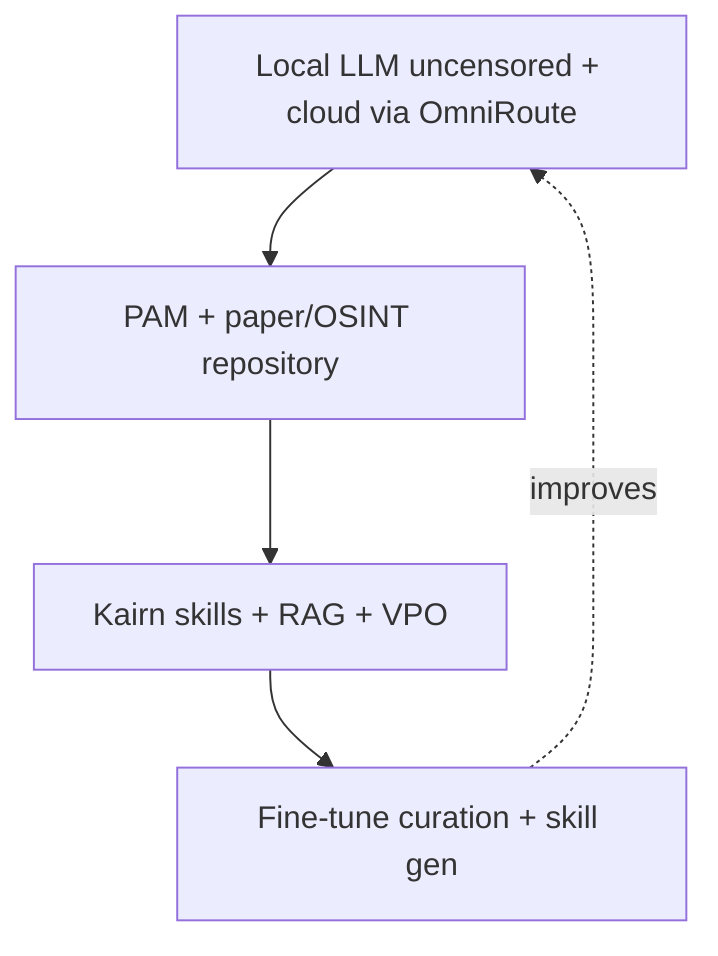

# Intelligence Stack — beyond raw FLOPs

A 3–7B Q4 on pendrive silicon will not beat GPT-5 / Claude Opus on random
trivia. Physics. The stack closes the gap where it matters: **your domain,
your papers, your skills, your uncensored local brain**, with cloud spillover
only under Manifest + WiFi.



## Layers in this repo

| Layer | Module | Role |
|-------|--------|------|
| Capability model | `robin_igris/model_capabilities.py` | Rank local vs coding/reasoning/longctx/…; learn from outcomes |
| Routing | `robin_igris/routing.py` | Offline-first + capability-rank spillover |
| Papers / OSINT | `aos/research/` | Agent-native paper store, claim extract, promote |
| RAG | `aos/research/rag.py` | Keyword hybrid over papers + soul |
| Curation | `robin_igris/system3/curation.py` | SFT / preference jsonl for idle NPU fine-tunes |
| Facade | `robin_igris/intelligence.py` | Wired into kernel boot + `:intel` / `:papers` |
| Tools | `paper_ingest`, `paper_search`, `capability_rank`, … | Agent-callable |

## Honest uncensored model

| | Cloud APIs | Local on Carry |
|--|------------|----------------|
| Filters | Built-in | None — weights on your stick |
| Query logging | Provider | Zero (local path) |
| ToS limits | Yes | Your hardware |
| Raw capability | Higher FLOPs | Weaker alone; stack recovers domain performance |

Manifest:

```json
"intelligence": {
  "prefer_uncensored": true,
  "prefer_privacy": false,
  "paper_ingest": true,
  "rag": true,
  "curation": true
}
```

## Paper ingestion loop

```
ingest → extract claims → link into PAM semantic →
optional Kairn skill hint → promote only if it helps
```

Offline:

```bash
# shell
:papers
# or tool
paper_ingest title="SDP memory" text="## Abstract\n..." tags="openlife,memory"
```

Online (network + Manifest): arXiv id/URL via `ingest_auto`.

## Growth loop

Week 1: local 7B, empty library  
→ papers + skills  
→ fine-tune export (`curation_export`) on idle NPU  
→ domain specialist that can beat frontier models **on your work**

Shell: `:intel` · `:papers <query>`
