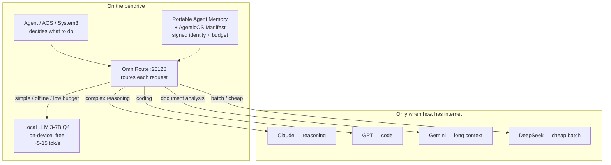

# OmniRoute — pendrive-aware LLM router

Robin Igris uses **[OmniRoute](https://github.com/diegosouzapw/OmniRoute)** as the
LLM **routing layer** for Pendrive-Native Agent OS — not a single hard-coded model.

A pendrive has limited compute. A single local LLM is slow and not best for every
task. OmniRoute dispatches by capability, cost, and connectivity:



## What OmniRoute gives the pendrive

| Property | Behavior |
|----------|----------|
| **Offline-first** | No network (or `ROBIN_FORCE_OFFLINE=1`) → every query uses `OMNIROUTE_LOCAL_MODEL` |
| **Online spillover** | With internet, hard tasks route to stronger APIs; simple ones can stay local / auto |
| **Cost control** | Manifest `budget.cloud_min_usd` + System 3 metabolism — below threshold → local only |
| **No hardcoding** | OmniRoute discovers connected providers; new host / new keys → adapts |

Policy lives in `robin_igris/routing.py` and is audited by AOS as `llm_route`.

## Stack fit

| Layer | What | Purpose |
|-------|------|---------|
| Kernel | Minimal Linux (Alpine / TinyCore) Live USB | Boot session from USB into RAM |
| Hardware discovery | Octopus-inspired (`aos/octopus.py`) | Probe GPU, audio, display at boot |
| Capability isolation | AgenticOS Manifest | Agent declares needs; capsule = Manifest ∩ Hardware |
| Agent runtime | AOS + optional Hermes | Persistent agent; SOUL on stick |
| Avatar | AIRI Live2D | Visible face — the UI |
| Voice | edge-tts / Whisper+Piper (planned) | Hear and speak |
| Memory | Portable Agent Memory (`aos/soul.py`) | Cryptographically tipped soul on USB |
| **LLM routing** | **OmniRoute** | Local offline; cloud spillover when available |
| Local LLM | Quantized 3–7B via OmniRoute provider (Ollama / llama.cpp) | Runs on borrowed GPU/CPU |
| Data | USB `data/` (F2FS/exFAT in deployment notes) | Soul, journal, skills |

## Install & run

```bash
npm i -g omniroute && omniroute
# or: ./scripts/start-omniroute.sh
```

Dashboard: http://127.0.0.1:20128 — add:

1. A **local** provider (Ollama / OpenAI-compatible local server) named so model id `local` (or set `OMNIROUTE_LOCAL_MODEL`) resolves.
2. Cloud API keys for spillover (optional).
3. An OmniRoute API key → `.env` as `OMNIROUTE_API_KEY`.

## Env

```env
OMNIROUTE_BASE_URL=http://127.0.0.1:20128/v1
OMNIROUTE_API_KEY=omniroute
OMNIROUTE_MODEL=auto
OMNIROUTE_LOCAL_MODEL=local
OMNIROUTE_MODEL_CODING=auto
OMNIROUTE_MODEL_REASONING=auto
OMNIROUTE_MODEL_LONGCTX=auto
OMNIROUTE_MODEL_CHEAP=auto
OMNIROUTE_CLOUD_MIN_BUDGET=0.05
ROBIN_FORCE_OFFLINE=0
ROBIN_START_OMNIROUTE=1
```

Manifest (on USB `data/aos/manifest.json`) may include:

```json
{
  "budget": { "balance_usd": 5.0, "cloud_min_usd": 0.05 },
  "routing": { "force_local": false, "prefer_cloud": false }
}
```

## Check

```bash
python -c "from robin_igris.routing import resolve_route; print(resolve_route(has_network=False))"
python -c "from robin_igris.routing import resolve_route; print(resolve_route(has_network=True, user_text='refactor this python module'))"
```
