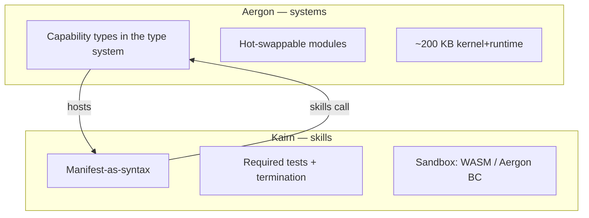

# Aergon & Kairn — languages for a self-evolving agent OS

> No existing language was designed so an agent can safely rewrite itself on a USB stick.
> We co-design **two** languages: systems (Aergon) and skills (Kairn).

| | **Aergon** | **Kairn** |
|--|------------|-----------|
| Who writes it | OS builders (you) | The agent (auto-generated) |
| Role | Kernel, runtime, drivers, hotswap ABI | Skills that evolve |
| Safety | Capability types + linear types | Sandboxed bytecode + Manifest |
| Codegen | Native / static binary | WASM or Aergon bytecode |
| Footprint target | ~200 KB core | ~50 KB skill runtime |
| Updates | Signed secondary USB only | Agent deploy anytime (after tests) |

- Spec: [AERGON.md](AERGON.md) · [KAIRN.md](KAIRN.md)
- Prototypes: `languages/aergon/` · `languages/kairn/`
- Vision link: [../research/PNAOS_VISION.md](../research/PNAOS_VISION.md)
