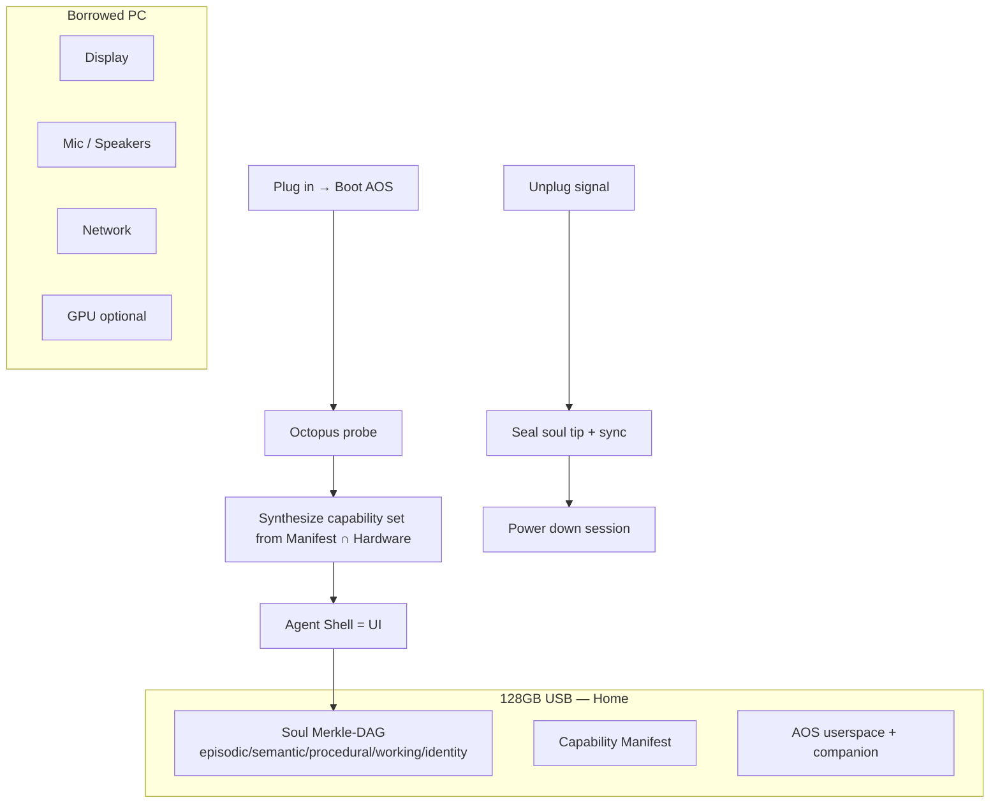

# Pendrive-Native Agent Operating System (PNAOS)

**Robin Igris AOS** — the agent *is* the operating system; the USB stick *is* home;
the host PC is borrowed peripherals.

> Novel claim: no published system combines (1) USB-resident boot, (2) host-as-borrowed-hardware,
> (3) agent-as-shell UI, (4) unplug-as-intentional-shutdown, and (5) cryptographic soul-on-stick.
> Prior work supplies the pieces; PNAOS is the composition.

**Full paper draft:** [PNAOS_PAPER.md](PNAOS_PAPER.md)  
**Born-for-pendrive vision:** [PNAOS_VISION.md](PNAOS_VISION.md)

### Three axioms (v2)

1. **Offline-first** — the pendrive *is* the world; WiFi is a borrowed sense.
2. **Permissioned connectivity** — Manifest-authorized SSIDs/actions only; offline default.
3. **Self-evolving shell** — skills grow under agent control; immutable core never updates over WiFi.

## Research lineage

| Paper | ID | Borrowed idea |
|-------|-----|---------------|
| [Agent Operating Systems (AOS)](https://www.alphaxiv.org/abs/2606.01508) | 2606.01508 | Agentic control plane; goal-progress scheduling; memory classes; tool mediation |
| [AgenticOS](https://www.alphaxiv.org/abs/2606.21129) | 2606.21129 | Manifest-Only Runtime — capabilities declared, undeclared stubs absent |
| [Portable Agent Memory](https://www.alphaxiv.org/abs/2605.11032) | 2605.11032 | Five-component soul; Merkle-DAG provenance; cross-host continuity |
| [Octopus Protocol](https://www.alphaxiv.org/abs/2605.09055) | 2605.09055 | One-shot hardware discovery → Infrastructure-as-Prompts |
| [Qualixar OS](https://www.alphaxiv.org/abs/2604.06392) | 2604.06392 | Design philosophy: OS built *for* agents |
| [AOHP](https://www.alphaxiv.org/abs/2606.23449) | 2606.23449 | Agent as OS-level service / harness |
| [Channel Fracture / CADVP](https://www.alphaxiv.org/abs/2606.04896v2) | 2606.04896 | Delivery verification; never trust silent scheduled writes |
| OpenLife / Sophia / OpenSkill | 2606.31046 / 2512.18202 / 2606.06741 | Persistence, System 3, skill evolution |

Each paper solves **one piece**. None combine USB boot + borrowed host + agent-as-shell + unplug shutdown + soul-on-stick. See the paper draft for the full “what it doesn’t do” table and gap claim.

## Five axioms (the gap)

1. **Boots from USB into a minimal host session** — stick holds the system image + soul.
2. **Host PC = borrowed peripherals** — display, keyboard, mic, GPU discovered fresh each plug-in (Octopus).
3. **Agent IS the OS shell** — no desktop, no window manager as the primary UX; the avatar *is* the login.
4. **Unplug = intentional shutdown** — first-class lifecycle event, not a crash (flush soul, seal Merkle tip).
5. **Identity lives on the stick** — hardware is interchangeable; continuity is cryptographic (PAM).



## Architecture

### Control plane (from AOS)
- **Goal scheduler** — progress on intents, not thread quanta
- **Memory classes** — ephemeral / durable / retrieved / execution records
- **Tool mediation** — every side effect through the registry
- **Audit** — decision lineage

### Manifest-Only Runtime (from AgenticOS)
Agents declare a `manifest.yaml`. Undeclared capabilities are **not present**
(no network stubs if `network: false`). The capsule is synthesized at boot from
`Manifest ∩ DiscoveredHardware`.

### Soul (from Portable Agent Memory)
On-stick store under `soul/`:
- `identity`, `episodic`, `semantic`, `procedural`, `working`
- Content-addressed entries + Merkle tip file
- Optional Ed25519 / HMAC seal for transfer continuity

### Octopus probe
At boot, emit a structured hardware prompt (CPU, RAM, displays, audio, net, GPU)
injected into the agent context: *“You are running on borrowed hardware X.”*

### Lifecycle
| Event | Action |
|-------|--------|
| Plug / boot | Probe → synthesize capsule → start agent shell |
| Heartbeat | System 3 intrinsic goals (OpenLife) |
| Unplug / SIGTERM / power loss prep | Flush journal, seal Merkle tip, CADVP confirm |
| Replug on new PC | Rehydrate soul, re-probe hardware, continue identity |

## Implementation in this repo

```
aos/                 Pendrive-Native Agent OS (userspace control plane)
  boot.py            USB boot entry
  kernel.py          Goal scheduler + mediation
  manifest.py        Manifest-Only Runtime
  soul.py            Portable Agent Memory
  octopus.py         Hardware discovery
  lifecycle.py       Unplug-as-shutdown
  shell.py           Agent-is-the-UI launcher
usb/                 Pendrive kit (existing) + aos-boot hooks
scripts/prepare-usb.sh
scripts/build-liveusb-notes.md
```

**Honesty:** This is a **userspace AOS** that can (a) run as the sole session from a Live USB
or (b) launch from `LAUNCH.bat` on a host OS. It does **not** replace the Linux kernel.
It *does* subsume the desktop metaphor: the agent shell is the only intended interface.

## Evaluation criteria (adapted from AOS paper)

1. Deterministic capability enforcement (Manifest gate)
2. Audit completeness (lineage log)
3. Soul continuity across hosts (Merkle tip match after replug)
4. Unplug seal success rate
5. Hardware re-adaptation latency (Octopus → context)

## Citation sketch

If published, cite Sharma & Shah (AOS), AgenticOS, Portable Agent Memory, Octopus Protocol,
plus OpenLife / Sophia / Channel Fracture for persistence and delivery reliability.
The contribution is the **pendrive-native composition** where the agent is the OS.
