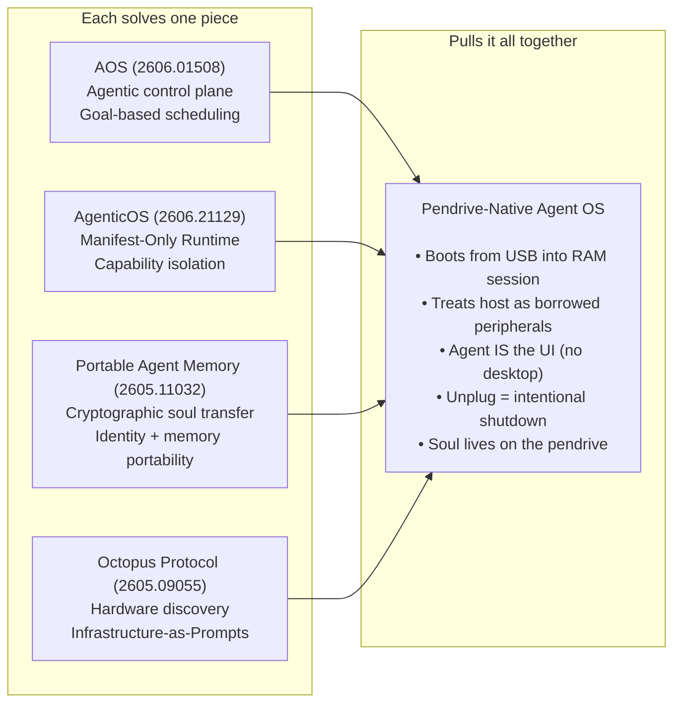
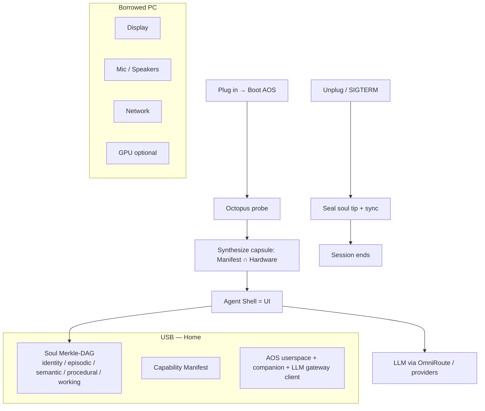

# Pendrive-Native Agent Operating Systems: Composing Agentic Control Planes into a USB-Resident, Agent-as-OS Runtime

**Working draft — Robin Igris / PNAOS**

Sanath S. Patil  
Independent / Robin Igris project  
Correspondence: sanathpatil8861@gmail.com

---

## Abstract

Recent work formalizes *Agent Operating Systems* (AOS), Manifest-Only capability isolation, cryptographically portable agent memory, and Infrastructure-as-Prompts hardware discovery. None of these systems, however, treat **USB-resident boot**, **host-as-borrowed-peripherals**, **agent-as-shell UI**, **unplug-as-intentional-shutdown**, and **soul-on-stick identity** as first-class design constraints simultaneously.

We introduce **Pendrive-Native Agent OS (PNAOS)**: a composition architecture in which the agent *is* the operating system shell, the USB stick is home storage for identity and memory, and every host PC is interchangeable borrowed hardware discovered at boot. We map prior papers onto layers of this stack, state the five-axiom gap that no existing paper fills, describe a userspace reference implementation (Robin Igris), and propose evaluation criteria for continuity, capability enforcement, and unplug seal reliability.

> **Contribution claim.** PNAOS is not a new scheduler or a new memory codec in isolation. It is the first design that **pulls AOS + AgenticOS + Portable Agent Memory + Octopus into a single bootable, USB-resident image** where the agent *is* the OS.

---

## 1. Introduction

AI agents today are applications bolted onto conventional desktops: they borrow a fixed machine’s filesystem, network stack, and display session, and their “identity” is scattered across cloud accounts, local caches, and chat logs. A parallel research thread asks a harder question: what if the *agent* were the primary OS abstraction?

Several 2025–2026 papers build pieces of that answer—agentic control planes, Manifest-gated capabilities, portable memory, hardware-as-prompt—but each assumes fixed hardware or sits atop a traditional host OS. The design we pursue is stricter and more personal:

1. The OS boots from a **USB stick** (session in RAM; durable state on the stick).
2. The host computer is **borrowed peripherals**, rediscovered every plug-in.
3. The agent **is** the OS—no desktop, no window manager, no login screen; the avatar *is* the shell.
4. **Unplugging** is the intended shutdown, not a crash.
5. The agent’s **identity and memories live on the USB**; hardware is interchangeable.

No published system states all five together. This paper positions PNAOS in that gap, surveys the pieces that already exist, and describes a reference composition.

---

## 2. Related Work — Papers That Lead Toward the Idea

There is no single paper that describes exactly this proposal. Several recent works build critical pieces. Table 1 records what each contributes and what it *does not* do.

| Paper | What it contributes | What it *doesn't* do |
|---|---|---|
| [Agent Operating Systems (AOS)](https://www.alphaxiv.org/abs/2606.01508) | Formalizes agents as **first-class OS entities**, not applications. Agentic control plane with goal-progress scheduling (not thread progress), memory classes (ephemeral, durable, retrieved, execution records), and tool mediation. Notes AOS may eventually “subsume selected OS responsibilities.” | Assumes conventional hardware (fixed storage, always-present kernel). Never considers USB portability or borrowed peripherals. |
| [AgenticOS](https://www.alphaxiv.org/abs/2606.21129) | Agents submit **intent declarations (Manifests)** instead of raw syscalls. Manifest determines capabilities—if network is undeclared, the capsule has **no network call stubs**. “Manifest-Only Runtime” matches how a pendrive OS should synthesize a minimal capability set. | Designed for fixed hardware. Ghost Kernel is a trusted hypervisor—not a tiny USB-bootable image. |
| [Portable Agent Memory](https://www.alphaxiv.org/abs/2605.11032) | Protocol for **cryptographically transferring agent memory** across heterogeneous systems. Five-component model (episodic, semantic, procedural, working, identity) with Merkle-DAG provenance and Ed25519 signing. Transfer Continuity Scores 0.83–0.92 across Claude, GPT, Gemini. The “soul on a USB stick” idea. | Addresses memory transfer only—not the runtime that hosts the agent. A pendrive needs *both* memory portability and a self-contained runtime. |
| [Qualixar OS](https://www.alphaxiv.org/abs/2604.06392) | Application-layer OS for agent orchestration: 12 multi-agent topologies, LLM team design, model routing, behavioral contracts. Design philosophy: build an OS *around* agents. | Runs on a conventional OS; does not challenge the hardware abstraction layer. |
| [AOHP](https://www.alphaxiv.org/abs/2606.23449) | Open-source OS-level agent harness for personalized, efficient, secure interaction; agent as OS service. | Assumes a traditional host OS. |
| [Octopus Protocol](https://www.alphaxiv.org/abs/2605.09055) | One-shot hardware discovery and control via **Infrastructure-as-Prompts**. Probe attached hardware at startup; expose it as structured agent context—“boot, discover, adapt.” | Targeted at robotics, not general-purpose agent computing. |

**Adjacent persistence & delivery work** we also rely on in the reference system:

- OpenLife, Sophia, OpenSkill — long-horizon persistence, System 3 identity, skill evolution.
- Channel Fracture / CADVP — delivery verification so scheduled memory writes are never silently trusted.

---

## 3. The Gap — What Is Not in Any Paper

No research paper describes a system where:

1. **The OS is booted from a USB stick** and runs primarily as a RAM-resident session with durable state on the stick.
2. **The host computer is treated as borrowed peripherals** — discovered fresh each boot.
3. **The agent *is* the OS** — there is no desktop, no window manager, no login screen; the avatar *is* the shell.
4. **Unplugging is the intended shutdown** — not a crash, but a first-class event the OS is designed for.
5. **The agent’s identity and memories live on the USB** — the hardware it runs on is interchangeable.

Existing papers build pieces of the stack:

| Piece | Source |
|-------|--------|
| Agentic control plane theory | AOS |
| Manifest-based capability isolation | AgenticOS |
| Cryptographic soul transfer | Portable Agent Memory |
| Runtime hardware discovery | Octopus Protocol |

**PNAOS is the composition:** pull all of these into a single, bootable, USB-resident image where the agent *is* the operating system. That sub-area is wide open.

---

## 4. Design — Pendrive-Native Agent OS (PNAOS)

### 4.1 Five axioms

| # | Axiom | Implication |
|---|-------|-------------|
| A1 | USB boot / RAM session | Stick holds image + soul; session does not depend on host disk |
| A2 | Host = borrowed peripherals | Display, audio, net, GPU rediscovered every plug-in (Octopus) |
| A3 | Agent is the shell | No desktop as primary UX; avatar/CLI *is* login |
| A4 | Unplug = intentional shutdown | Seal Merkle tip; treat yank as designed exit (with best-effort flush) |
| A5 | Soul on stick | Identity continuous across hosts via PAM-style provenance |

### 4.2 Layer mapping

### 4.3 Control plane (from AOS)

- **Goal scheduler** — progress on intents, not thread quanta.
- **Memory classes** — ephemeral / durable / retrieved / execution records (mapped onto soul classes).
- **Tool mediation** — side effects only through a capability-checked registry.
- **Audit** — decision lineage on the stick.

### 4.4 Manifest-Only Runtime (from AgenticOS)

Agents declare a Manifest. Undeclared capabilities are **absent** (no stubs). At boot:

\[
\text{EffectiveCaps} = \text{Manifest} \cap \text{DiscoveredHardware}
\]

Example: Manifest allows `network`, but Octopus finds no connectivity → capsule has no network path for that session.

### 4.5 Soul (from Portable Agent Memory)

On-stick store:

- Classes: `identity`, `episodic`, `semantic`, `procedural`, `working`
- Content-addressed entries + Merkle tip
- HMAC (reference) / Ed25519 (target) seal for transfer continuity

Replug on a new host: rehydrate soul → re-probe hardware → continue identity under a new capsule.

### 4.6 Octopus probe

At boot, emit structured hardware context (CPU, RAM, displays, audio, net, GPU) into the agent prompt: *“You are running on borrowed hardware X.”*

### 4.7 Lifecycle

| Event | Action |
|-------|--------|
| Plug / boot | Probe → synthesize capsule → start agent shell |
| Heartbeat | Intrinsic goals / System 3 (OpenLife-style) |
| Unplug / SIGTERM | Flush journal, seal Merkle tip, optional CADVP confirm |
| Replug on new PC | Rehydrate soul, re-probe, continue |

### 4.8 Honesty bound (kernel vs metaphor)

A full replacement of Linux/Windows kernels is out of scope for the reference system. PNAOS is specified as a **userspace Agent OS** that:

- (a) can be the **sole interactive session** from a Live USB (no desktop), or
- (b) launches from a host OS while still enforcing A2–A5.

It *subsumes the desktop metaphor* even when it does not replace the kernel. True “boot from stick into RAM” is achieved by pairing PNAOS with a minimal Live ISO (e.g. Ventoy + Debian Live auto-login into the agent shell).

---

## 5. Reference Implementation — Robin Igris

Open composition in this repository:

| Module | Role |
|--------|------|
| `aos/kernel.py` | Goal scheduler + tool mediation + audit |
| `aos/manifest.py` | Manifest-Only Runtime |
| `aos/soul.py` | Five-class soul + Merkle tip + seal |
| `aos/octopus.py` | Hardware discovery → prompt |
| `aos/lifecycle.py` | Unplug / signal → seal |
| `aos/shell.py` / `boot.py` | Agent-is-the-UI |
| `usb/` + `scripts/prepare-usb.sh` | 128GB pendrive kit |
| OmniRoute client | LLM via local OpenAI-compatible gateway |
| System 3 + CADVP | Persistence, skills, delivery verification |

Entry points: `AOS_BOOT.bat` / `aos-boot.sh` (agent OS mode); `LAUNCH.bat` (companion avatar as shell).

---

## 6. Evaluation Criteria

Adapted from AOS-style metrics and the five axioms:

1. **Deterministic capability enforcement** — Manifest∩Hardware gates; undeclared caps raise `PermissionError` / have no stubs.
2. **Audit completeness** — mediation lineage recoverable from stick logs.
3. **Soul continuity across hosts** — Merkle tip verifies after replug on different machines; Transfer Continuity Score analogue (PAM).
4. **Unplug seal success rate** — fraction of controlled unplug/SIGINT events that leave a valid tip (target ≥ 0.99 under graceful signal; best-effort under hard power loss).
5. **Hardware re-adaptation latency** — Octopus probe → capsule → agent context (target: sub-second probe on commodity PCs).
6. **Session purity** — can a Live USB boot reach agent shell with no desktop interaction? (binary + time-to-shell).

---

## 7. Threats & Limitations

- **Hard yank** before flush can lose the last seconds of episodic memory; hardware write barriers and power-loss journals are future work.
- **Userspace bound** — without Live USB, a hostile host OS can still observe the session.
- **LLM dependency** — reasoning quality tracks whatever gateway/providers OmniRoute routes to; PNAOS does not claim a new foundation model.
- **Signing** — reference seal is HMAC; full PAM Ed25519 transfer protocol is planned.

---

## 8. Conclusion

AOS, AgenticOS, Portable Agent Memory, and Octopus each solve one piece of agent-native computing. **Pendrive-Native Agent OS** is the composition that makes the agent the OS, the USB stick home, and every PC borrowed hardware—with unplug as a first-class shutdown. The sub-area is open; the Robin Igris reference system is an invitation to measure, harden, and publish.

---

## References

1. Agent Operating Systems (AOS). alphaXiv:2606.01508. https://www.alphaxiv.org/abs/2606.01508  
2. AgenticOS. alphaXiv:2606.21129. https://www.alphaxiv.org/abs/2606.21129  
3. Portable Agent Memory. alphaXiv:2605.11032. https://www.alphaxiv.org/abs/2605.11032  
4. Qualixar OS. alphaXiv:2604.06392. https://www.alphaxiv.org/abs/2604.06392  
5. AOHP. alphaXiv:2606.23449. https://www.alphaxiv.org/abs/2606.23449  
6. Octopus Protocol. alphaXiv:2605.09055. https://www.alphaxiv.org/abs/2605.09055  
7. Channel Fracture / CADVP. alphaXiv:2606.04896. https://www.alphaxiv.org/abs/2606.04896v2  
8. OpenLife. alphaXiv:2606.31046  
9. Sophia. arXiv:2512.18202 / alphaXiv  
10. OpenSkill. alphaXiv:2606.06741  
11. OmniRoute. https://github.com/diegosouzapw/OmniRoute  
12. Robin Igris / PNAOS reference. https://github.com/seven0070/robin-igris-

---

## Appendix A — Suggested citation (self)

> Patil, S. S. (2026). *Pendrive-Native Agent Operating Systems: Composing Agentic Control Planes into a USB-Resident, Agent-as-OS Runtime* (working draft). Robin Igris project.

## Appendix B — Repo map for reviewers

See also: `docs/research/PENDRIVE_AGENT_OS.md` (design notes), `docs/research/FOUNDATIONS.md` (System 3 lineage), `docs/OMNIROUTE.md` (LLM gateway).
