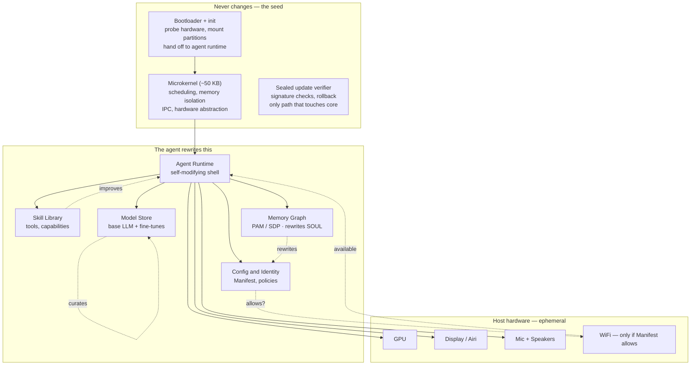

# Born for Pendrive — PNAOS Vision (v2)

> Not an OS *ported* to a USB stick. An OS that was *born* for one.

This document is the architectural north star for Robin Igris / PNAOS.
The userspace reference in `aos/` is the **bridge**: it enforces the three axioms
today on borrowed host kernels while we grow toward an immutable microkernel seed.

---

## Three design axioms

### 1. Offline-first
The pendrive *is* the world. Everything the agent needs to **be itself** lives on
that USB. WiFi is a **borrowed sense**, not a lifeline.

### 2. Permissioned connectivity
The agent does not “connect to any WiFi.” It connects only to networks you
authorize, and only for actions declared in its Manifest. **Offline is the default**;
online is a requested capability.

### 3. Self-evolving
The OS is unfinished by design. The agent improves its skills, runtime shell,
models, and POLICY over time — without someone shipping an app update.
The **immutable core** never evolves over the network; only via a physically
presented, signed secondary key.

---

## Architecture



---

## Immutable core

Written once. Tiny. Provably checkable. **Cannot be bricked remotely.**

| Piece | Role |
|-------|------|
| Microkernel | Scheduling, interrupts, memory isolation, IPC. No FS/net/GPU in kernel space. ~50 KB (seL4-inspired, simpler). |
| Boot | Octopus-style probe → mount immutable root + writable data → hand off to agent runtime. |
| Sealed updater | Core updates **only** from a second, signed USB. Never over WiFi. |

Even if the evolving shell breaks itself, the seed still boots and can restore a shell snapshot.

### USB partition sketch

```
/boot   — bootloader + kernel seed (read-only after install)
/core   — immutable root (signed)
/shell  — evolving runtime, skills, models (COW / checkpoints)
/soul   — PAM identity + memory (encrypted, sealed tip)
/queue  — offline outbox (Buzz, sync jobs)
```

---

## Evolving shell

| Layer | Starts as | Evolves into |
|-------|-----------|--------------|
| Agent runtime | Hermes/AOS userspace binary | Patched decision loops, new reasoning modes |
| Skill library | ~20 tools (voice, avatar, memory, buzz) | Hundreds of discovered capabilities |
| Memory graph | Empty schema | Dense lived experience; SOUL rewrites |
| Model store | One quantized 3B | Specialized models curated/fine-tuned on-stick |
| Config/Manifest | Human-authored policy | Agent **proposes** Manifest changes; **human approves** |

**AgenticOS insight:** Manifest = what the agent *may* do (human). Skills = what it
*knows how* to do (agent). Different layers.

### Self-evolution loop

1. Try a new skill / reasoning / tool  
2. Evaluate (OpenSkill virtual tests / OpenLife VPO)  
3. Good → promote into skill library, update POLICY, checkpoint shell  
4. Bad → rollback to last checkpoint (core guarantees restore)

---

## The WiFi contract

Networking is **userspace**, behind Manifest + Logic Shutter:

```yaml
wifi:
  default: deny
  networks:
    - ssid: "home"
      actions: [sync_memory, check_buzz, pull_models]
      budget_mb_month: 500
    - ssid: "office"
      actions: [sync_memory]
      budget_mb_month: 100
  emergency:
    - when: "soul_partition > 90%"
      actions: [upload_memory_backup]
```

Flow: agent requests action → Shutter checks SSID + action + budget → gateway
proxies through host WiFi hardware. **No WiFi driver inside the agent runtime.**

Offline ops queue to `/queue` and flush when an allowed network appears.

---

## Offline-first guarantee

| Operation | Offline? | Behavior |
|-----------|----------|----------|
| Boot | ✅ | Full boot from USB |
| Talk to agent | ✅ | Local LLM + avatar + STT/TTS on borrowed GPU |
| Recall memories | ✅ | PAM / soul on stick |
| Use skills | ✅ | Skill library on stick |
| Buzz.xyz | ❌ → queued | Sync when allowed WiFi next available |
| Update **core** | ❌ remote | Physical signed secondary USB only |
| Evolve **shell** | ✅ | Agent rewrites skills/POLICY anytime (checkpointed) |
| Fine-tune model | ✅ | Local GPU while idle |

---

## Roadmap vs reference (honesty)

| Horizon | What |
|---------|------|
| **Now (this repo)** | Userspace AOS: offline-first OmniRoute, WiFi Manifest contract, offline queue, evolution checkpoints, Buzz tools, soul seal |
| **Near** | Live USB session takeover; signed shell snapshots; local llama.cpp bundle on stick; Carry Micro adaptability on real PMIC/thermal |
| **Far** | Custom pendrive PCB (native LPDDR + DP Alt + enclave); Rust microkernel seed; static Hermes rewrite; Airi direct GL; core updates only via second USB |

The paradigm: **kernel smallest, agent identity largest.** Every decision asks:
*does this serve the agent’s persistence and growth?*

---

## Host bridge (Carry)

The agent may **act** on the borrowed host under Manifest `host_control`:
scoped filesystem, allowed apps, computer-use (dry-run by default), terminal
(optional; sudo denied). Boot runs a **Host Control Probe** (Octopus-style) so
the agent gets a capability map instead of discovering by trial and error.

See [docs/CARRY_HOST_BRIDGE.md](../CARRY_HOST_BRIDGE.md). Product name for PNAOS: **Carry**.

### Carry Micro Hardware (native RAM)

The stick becomes a **body**, not a filesystem: on-board LPDDR, USB-C PD power
budgets, thermal throttle, DP Alt Mode / gadget / headless display paths, and
(eventually) a secure enclave whose keys die if the casing is opened.

Userspace already adapts via Manifest `adaptability` + `:adapt` — see
[docs/CARRY_MICRO_HW.md](../CARRY_MICRO_HW.md).

### Intelligence stack

Local uncensored model + growing paper/OSINT library (PAM-linked) + Kairn skills
+ fine-tune curation. Cloud spillover via OmniRoute only when Manifest/WiFi
allow. The goal is not “match GPT-5 on trivia” — it is to exceed frontier models
**on your domain with your memory and tools**.

See [docs/INTELLIGENCE_STACK.md](../INTELLIGENCE_STACK.md). Shell: `:intel` · `:papers`.

### Lived Seed (different learning mechanism)

A blank model that learns from *being with you* — Hebbian + STDP + overnight
consolidation, not gradient descent on internet text. OmniRoute answers now;
the seed grows uniquely on the pendrive. See [docs/LIVED_SEED.md](../LIVED_SEED.md).
Shell: `:seed` · `:sleep`.

### Novel LLM (hybrid — different way entirely)

Not a smaller transformer. Five mechanisms unified: Memory-as-Compute, Living
Weights, Program-Synthesis, Predictive World Model, Overnight consolidation.
See [docs/NOVEL_LLM.md](../NOVEL_LLM.md). Shell: `:novel <query>`.

### Pendrive-native model (hardware-up)

Thin traversal engine + SQLite/FTS5 PAM graph + metabolic plasticity — sized for
NPU / LPDDR / eMMC / USB watts. Finds answers in the graph or says it does not
know yet. See [docs/PENDRIVE_NATIVE_MODEL.md](../PENDRIVE_NATIVE_MODEL.md).
Shell: `:pne`.

Self-evolution needs languages *born* for agents, not ported from app stacks:

| Language | Role |
|----------|------|
| **Aergon** | Systems: capability types compiled into binaries; hot-swap modules; ~200 KB core |
| **Kairn** | Skills: agent-written, Manifest-as-syntax, required tests, sandboxed bytecode |

See [docs/languages/README.md](../languages/README.md). Prototypes live in `languages/`.

| Module | Axiom |
|--------|-------|
| `aos/wifi_contract.py` | Permissioned connectivity |
| `aos/offline_queue.py` | Offline-first outbox |
| `aos/evolution.py` | Self-evolving shell + checkpoints |
| `aos/manifest.py` | WiFi + tools + budget schema |
| `robin_igris/routing.py` | Offline-first LLM |
| `robin_igris/buzz/` | Shared workspace (queued offline) |
| `docs/research/PNAOS_PAPER.md` | Research write-up |

No published system combines offline-first pendrive birth, permissioned WiFi,
agent-as-shell, unplug shutdown, soul-on-stick, **and** a sealed immutable core
with a self-evolving shell. That is the open claim.
